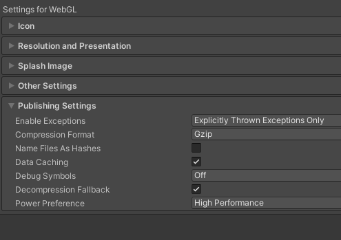
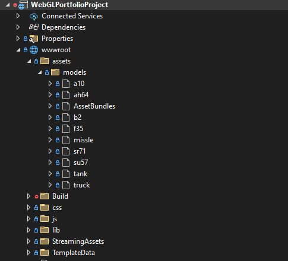

## Project Overview

This project demonstrates **asynchronous asset loading** in a **Unity WebGL application** with a **.NET backend**. The goal is to dynamically load assets at runtime from a remote server, reducing initial load times and improving performance. This repository consists of both the Unity Editor application and the .Net Visual Studio project. You can clone the repository or view it in action on my site here [http://www.brianhoglundportfolio.com](http://www.brianhoglundportfolio.com).

### Key Features:
- **WebGL Deployment**: Unity WebGL game runs directly in the browser.
- **Asynchronous Asset Loading**: Assets (models, textures, etc.) are loaded at runtime from the web server, reducing the initial load time.
- **.NET Backend**: A .NET server hosts and serves the asset bundles to the WebGL client.
- **Asset Bundles**: Unity Asset Bundles are used to package and serve assets separately from the WebGL build, allowing for efficient resource management.

### Workflow:
1. **Build Asset Bundles**: Unity builds asset bundles, which are uploaded to the .NET backend.
2. **Load Assets in WebGL**: The Unity WebGL client requests and loads asset bundles asynchronously from the server.
3. **Serve from .NET**: The .NET backend handles requests for asset bundles and serves them via HTTP.

This setup enables smaller WebGL builds and optimized loading of game assets.


## Unity Project
Let's start with the unity project that we will build into our .Net project. 

### 1. Creating the Asset Bundles
To start with, I've written a short script to build some of our 3D model prefabs into asset bundles.
```csharp
public class AssetBundleBuilder : MonoBehaviour
{
   [Button]
    static void BuildAllAssetBundles()
    {
        string outputDirectory = "Assets/AssetBundles";

        if (!Directory.Exists(outputDirectory))
            Directory.CreateDirectory(outputDirectory);

        BuildPipeline.BuildAssetBundles(outputDirectory, 
                                        BuildAssetBundleOptions.None, 
                                        BuildTarget.WebGL);

        Debug.Log("Asset Bundles built successfully!");
    }
}
```

### 2. Model Loader
Next we'll define a class for loading the asset bundles via a Unity web request. 
```csharp
public class ModelLoader
{
    public IEnumerator LoadModelAsync(ButtonModelAssociation modelAssociation, string baseUrl)
    {
        if (modelAssociation.SpawnedModel) yield break;

        if (string.IsNullOrEmpty(baseUrl))
        {
            modelAssociation.LoadedPrefab = modelAssociation.Prefab;
            yield break;
        }

        var url = $"{baseUrl}{modelAssociation.Prefab.name.ToLower()}";

        using var request = UnityWebRequestAssetBundle.GetAssetBundle(url);
        yield return request.SendWebRequest();

        if (request.result == UnityWebRequest.Result.Success)
        {
            var bundle = DownloadHandlerAssetBundle.GetContent(request);

            if (bundle == null)
            {
                Debug.LogError($"Failed to download AssetBundle from {url}: Bundle is null");
                yield break;
            }

            var prefab = bundle.LoadAsset<GameObject>(modelAssociation.Prefab.name);
            bundle.Unload(false);

            if (prefab != null) modelAssociation.LoadedPrefab = prefab;
            else Debug.LogError($"Prefab {modelAssociation.Prefab.name} not found in AssetBundle {url}");
        }
        else Debug.LogError($"Failed to load AssetBundle from {url}: {request.error}");
    }
}
```

### 3. Model Selector
The Model Selector class basically just makes a request to the model loader and to spawn the assets. It's critical for our development pipeline that we set this up in a way that makes this work in the following scenerios

- **Unity Editor**: Loads prefabs from the asset database.
- **IIS Express**: Loads asset bundles over localhost.
- **IIS Web Server**: Loads asset bundles from the web server domain.
```csharp
 private string GetBaseUrl()
 {
    // If in Unity Editor, models are loaded directly from the asset database
    if (Application.isEditor) return "";

    // If running on the web server, we load the asset bundles from the server domain.
    if (Application.platform == RuntimePlatform.WebGLPlayer)
    {
        var baseUri = new Uri(Application.absoluteURL);
        return baseUri.GetLeftPart(UriPartial.Authority) + "/assets/models/";
    }

    // If running locally using IIS Express.
    return "https://localhost:44367/assets/models/";
 }
```

The models are loaded sequentially, with a slight delay between loads to demonstrate the asynchronous behavior. 

```csharp
private IEnumerator LoadAllModelsSequentially()
{
    var isFirst = true;
    foreach (var item in buttonModels)
    {
        yield return modelLoader.LoadModelAsync(item, baseUrl);

        if (item.LoadedPrefab != null)
        {
            item.SpawnModel(OnModelSelected, isFirst);
            if(isFirst) orbitalCameraController.SetTarget(item.SpawnedModel);
            isFirst = false;
        }
        else
        {
            Debug.LogError($"Failed to load prefab for {item.Prefab.name}. Check logs for ModelLoader errors.");
            yield break;
        }

        yield return new WaitForSeconds(loadDelay);
    }
}
```

### 4. Building the Unity project

When building the Unity WebGL project, you have the option to choose the compression method for your assets. Here, we are using Gzip as it is efficient and compresses files quickly.



## Visual Studio files setup
Place the Unity WebGL build into the `wwwroot` folder of your Visual Studio project. Don’t forget to add the asset bundle files here as well.



## Web server configuration
Configure static file serving and compression in your `Startup.cs` file to serve assets and handle Gzip compression.

```csharp
builder.Services.AddResponseCompression(options =>
{
    options.EnableForHttps = true;
    options.Providers.Add<GzipCompressionProvider>();
});
```
```csharp
app.UseStaticFiles(new StaticFileOptions
{
    ServeUnknownFileTypes = true, // Ensure unknown file types like .bundle are served
    DefaultContentType = "application/octet-stream", // Fallback content type
    OnPrepareResponse = ctx =>
    {
        ctx.Context.Response.Headers["Cache-Control"] = "no-cache, no-store";
    }
});
```

### Deployment
Once the project is built, deploy it to your web server. The web page will load first, followed by the asynchronous loading of assets. You can check it out here [http://www.brianhoglundportfolio.com](http://www.brianhoglundportfolio.com).


